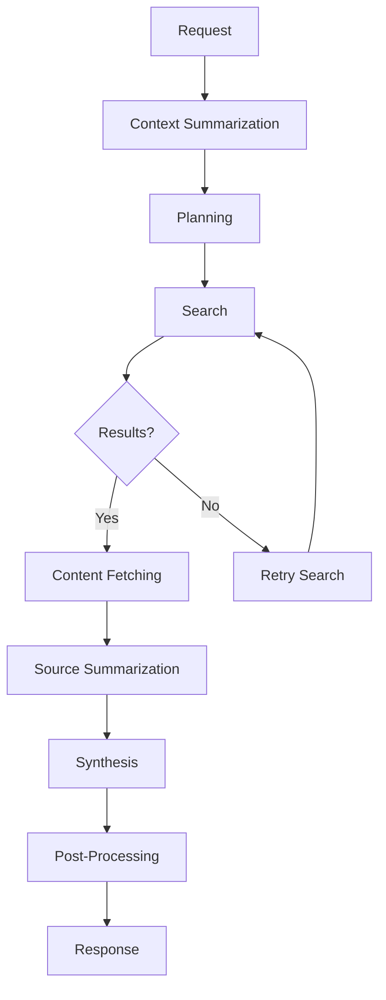

markdown
# Research Assistant - Context-Aware Research Brief Generator

A sophisticated research assistant system that generates structured, evidence-linked research briefs using LangGraph and LangChain. The system supports follow-up queries by maintaining user context and provides both HTTP API and CLI interfaces.

## Features

- **LangGraph Workflow Orchestration**: Modular, checkpointed execution flow
- **Context-Aware Follow-ups**: Maintains user history for contextual research
- **Structured Output Validation**: All outputs follow strict Pydantic schemas
- **Multiple LLM Support**: OpenAI GPT-4, GPT-3.5, and Anthropic Claude
- **Comprehensive Search**: Tavily, SERP API, and fallback search implementations
- **Full Observability**: LangSmith integration with detailed tracing
- **Production Ready**: Docker deployment, CI/CD pipeline, comprehensive testing

## Table of Contents

- [Architecture](#architecture)
- [Installation](#installation)
- [Configuration](#configuration)
- [Usage](#usage)
- [API Reference](#api-reference)
- [CLI Reference](#cli-reference)
- [Development](#development)
- [Deployment](#deployment)
- [Monitoring](#monitoring)
- [Contributing](#contributing)

## Architecture

### System Overview

The Research Assistant uses a multi-stage LangGraph workflow:



### Core Components

1. **LangGraph Workflow**: Orchestrates the entire research process
2. **LLM Service**: Manages multiple language models with retry logic
3. **Search Service**: Handles web search across multiple providers
4. **Context Service**: Manages user history and follow-up context
5. **Storage Service**: Persists user data and research history

### Schema Definitions

All data structures use Pydantic for validation:

- `BriefRequest`: Input validation and sanitization
- `ResearchPlan`: Search strategy and focus areas
- `SearchResult`: Web search results with relevance scoring
- `SourceSummary`: Individual source analysis
- `FinalBrief`: Complete research output with references


### Prerequisites

- Python 3.11+
- Poetry (recommended) or pip
- API keys for LLM and search providers


```bash


# Install dependencies
poetry install

pip install -r deployment/requirements.txt

# Configure environment
cp  .env


# Initialize database
poetry run python -c "from app.services.storage_service import StorageService; import asyncio; asyncio.run(StorageService().initialize())

# Start API server
poetry run python -m app.main
```